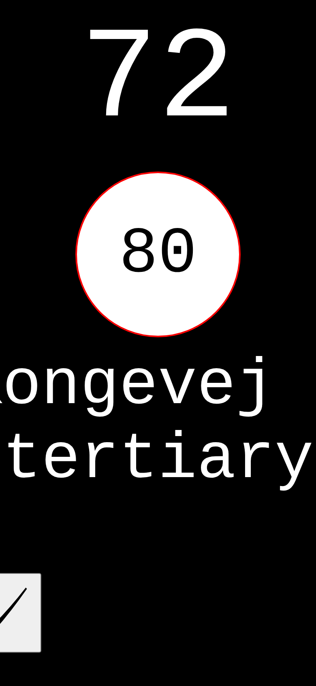
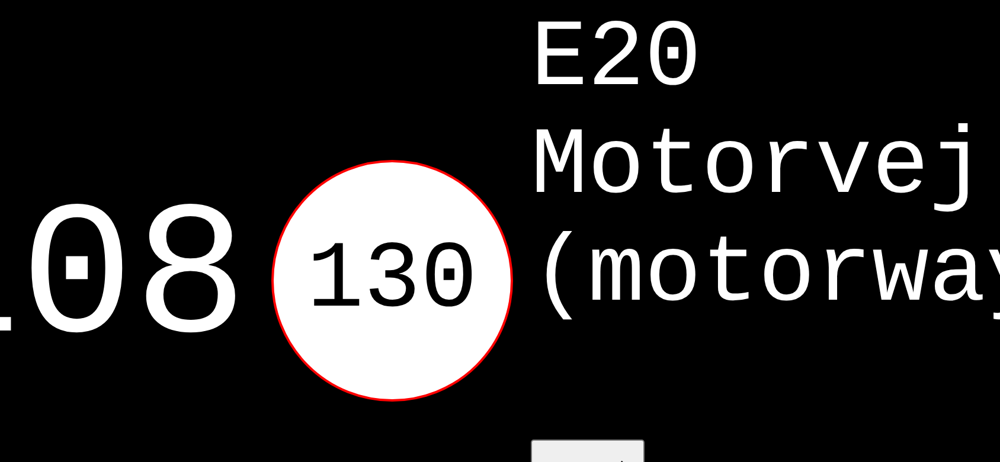

# Speedometer App

A Progressive Web App (PWA) speedometer for mobile devices. Shows your current GPS speed in km/h, the speed limit for the road you're on, and warns about nearby speed cameras — all from OpenStreetMap data, no API key required.

**Live app:** [joachimth.github.io/speedometer-app](https://joachimth.github.io/speedometer-app)

---

## Screenshots

| Portrait – startskærm | Portrait – kørende | Landscape – kørende |
|:-:|:-:|:-:|
|  |  |  |

---

## Features

- Large speed display in km/h (GPS-based)
- Speed limit for current road via OpenStreetMap / Overpass API
- Road name display
- Speed camera proximity alerts (OSM `highway=speed_camera` nodes, 500 m radius)
- Screen stays on while driving (`navigator.wakeLock`)
- Install as PWA on iOS and Android (standalone fullscreen mode)
- Landscape layout support
- No account, no API key, no tracking

---

## How to use

1. Open [the app](https://joachimth.github.io/speedometer-app) in Chrome or Safari on your phone
2. Allow location access when prompted
3. Tap the ▶ button to start
4. Drive — speed updates in real time, speed limit loads after a few GPS fixes

To install as an app: use "Add to Home Screen" in your browser.

---

## Architecture

Static PWA — no build step, no server. All files served directly via GitHub Pages.

```
index.html          Entry point + PWA manifest link
css/style.css       Dark theme, responsive layout
js/
  main.js           App init, GPS loop, wake lock, DOM updates
  location.js       navigator.geolocation wrapper
  speedlimit.js     Overpass API query for maxspeed tag
  speedcamera.js    Overpass API query for speed cameras
  helpers.js        Haversine distance, direction, road history
  trafikinfo.js     Traffic alerts (disabled, needs API key)
manifest.json       PWA metadata
capture-screenshots.js  Playwright screenshot automation (CI)
```

External dependency: [axios](https://unpkg.com/axios@1.1.2) loaded from CDN.

---

## CI/CD

| Workflow | Trigger | Action |
|---|---|---|
| `deploy.yml` | Push to `main` | Deploy to GitHub Pages |
| `screenshots.yml` | Push to `main` (UI files changed) | Capture screenshots, commit to repo |

Screenshots are generated automatically by a headless Playwright browser with injected simulated GPS data. No manual updates needed.

---

## License

[MIT](LICENSE)
